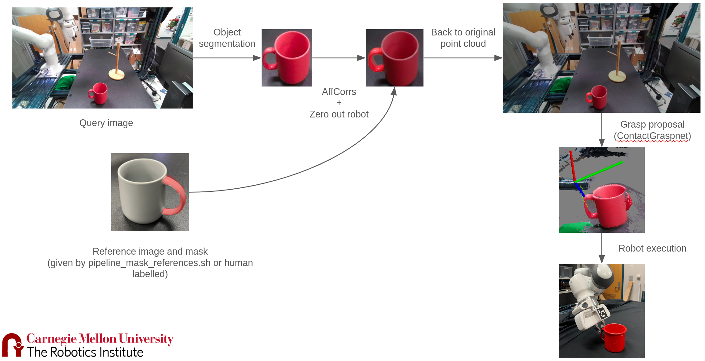

# Purpose
This repository offers scripts and utilities mainly for the purpose of having a pipeline that can learn tasks from human demonstrations and execute them on a robot.
## Camera Robot Calibration
Uses the repo [rtc_vision_toolbox](https://github.com/cmu-mfi/rtc_vision_toolbox) to perform robot camera calibration using an Aruco Marker, [Frankapy](https://github.com/jacintosuner/frankapy) to control the robot and [Pyk4a](https://github.com/etiennedub/pyk4a) to control the camera.
```bash
./scripts/perform_calibration.sh
```
## Automatic Mask References for [AffCorrs](https://github.com/RPL-CS-UCL/UCL-AffCorrs)
From an rgbd video, generate the "support" or "reference" image and mask necessary to run AffCorrs model.
```bash
./scripts/generate_mask_references.sh --base_dir data
```
## Run Grasping predictor and executor pipeline
This pipeline is given by the following steps:

```bash
./grasping_predictor_and_executor.sh --mask_reference_path ~/robot-grasp/data/mask_references/reference_20241122_153952 --object_name mug
```
## Capturing video demos
```bash
./scripts/capture_video_demos.sh --output_directory ~/robot-grasp/data/demos/videos --num_videos 15 --duration 6
```
## Turning video demos into TAXPOSED training data
```bash
./scripts/pipeline_process_demos_for_taxposed.sh --dir_path ~/robot-grasp/data/demos/demos_20241230_173916 --object_name mug
```
## Other
Other scripts and utilities are used for a wide variety of things, including capturing image and video using Pyk4a, resetting the franka arm position, preprocessing for the models used (contact graspnet, taxposed,...), point cloud visualizers,...

# Installation
## Prerequisites
### Frankarm / Frankapy connection and installation
In order to setup frankarm connection:
* Connect the ethernet cable to your desk, and change IPv4 Method to "Shared to other computers".
* Follow the instructions from frankapy's repo section "Configuring the network with the Control PC", including the IP Address setup for communication through a router (for some reason, setting both network configurations to Automatic doesn't work).


Follow installation steps for ROS1: https://robostack.github.io/GettingStarted.html#__tabbed_1_1
What worked for us:
``` bash
mamba create -n ros_noetic python=3.8 ros-noetic-ros-base ros-noetic-franka-gripper -c robostack -c conda-forge
```

Install catkin tools: `sudo pip3 install -U catkin_tools`


For more information, checkout this [Frankapy fork](https://github.com/jacintosuner/frankapy).


### Install k4a (for Ubuntu 22.04)
```bash
sudo apt-add-repository -y -n 'deb http://archive.ubuntu.com/ubuntu focal main'
sudo apt-add-repository -y 'deb http://archive.ubuntu.com/ubuntu focal universe'
sudo apt-get install -y libsoundio1
sudo apt-add-repository -r -y -n 'deb http://archive.ubuntu.com/ubuntu focal universe'
sudo apt-add-repository -r -y 'deb http://archive.ubuntu.com/ubuntu focal main'

wget "https://packages.microsoft.com/ubuntu/18.04/prod/pool/main/k/k4a-tools/k4a-tools_1.4.1_amd64.deb"
wget "https://packages.microsoft.com/ubuntu/18.04/prod/pool/main/libk/libk4a1.4/libk4a1.4_1.4.1_amd64.deb"
wget "https://packages.microsoft.com/ubuntu/18.04/prod/pool/main/libk/libk4a1.4-dev/libk4a1.4-dev_1.4.1_amd64.deb"


sudo dpkg -i libk4a1.4-dev_1.4.1_amd64.deb
sudo dpkg -i libk4a1.4_1.4.1_amd64.deb
sudo dpkg -i k4a-tools_1.4.1_amd64.deb

git clone https://github.com/microsoft/Azure-Kinect-Sensor-SDK.git
cd Azure-Kinect-Sensor-SDK
sudo cp scripts/99-k4a.rules /etc/udev/rules.d/

# disconnect and connect the camera again
k4aviewer
```

## Final Build (needs to be tested out from scratch)
Run `scripts/installation.sh`
For Anygrasp:
* Follow the steps provided in its github repository for downloading pointnet.
For Contact Graspnet:
* If pip issues arise during the creation of the conda environment contact_graspnet_env, try unsetting the variable PYTHONPATH: `unset PYTHONPATH`


## Old Repo
[Old repo](https://github.com/jacintosuner/old-robot-grasp)

## Repo from which this one comes from
This repo follows a template for a Python Machine Learning project with the following features:

* [Weights and Biases](wandb.ai) support, for experiment tracking and visualization
* [Hydra](https://hydra.cc/) support, for configuration management
* [Pytorch Lightning](https://www.pytorchlightning.ai/) support, for training and logging

In addition, it contains all the good features from the original version of this repository (and is a proper Python package):

* Installable via `pip install`. Anyone can point directly to this Github repository and install your project, either as a regular dependency or as an editable one.
* Uses the new [PEP 518, officially-recommended pyproject.toml](https://pip.pypa.io/en/stable/reference/build-system/pyproject-toml/) structure for defining project structure and dependencies (instead of requirements.txt)
* Nice, static documentation website support, using mkdocs-material. Structure can be found in `docs/`
* `black` support by default, which is an opinionated code formatting tool
* `pytest` support, which will automatically run tests found in the `tests/` directory
* `mypy` support, for optional typechecking of type hints
* `pre-commit` support, which runs various formatting modifiers on commit to clean up your dirty dirty code automatically.
* Github Actions support, which runs the following:
    * On a Pull Request: install dependencies, run style checks, run Python tests
    * After merge: same a Pull Request, but also deploy the docs site to the projects Github Pages URL!!!!

All that needs doing is replacing all occurances of `robot_grasp` and `robot-grasp` with the name of your package(including the folder `src/robot_grasp`), the rest should work out of the box!

## Installation

First, we'll need to install platform-specific dependencies for Pytorch. See [here](https://pytorch.org/get-started/locally/) for more details. For example, if we want to use CUDA 11.8 with Pytorch 2.

```bash
pip install torch==1.11.0+cu113 torchvision==0.12.0+cu113 torchaudio==0.11.0+cu113 -f https://download.pytorch.org/whl/torch_stable.html
```

In this case, we can use the command:
```bash
pip3 install torch torchvision torchaudio
```

Make sure to have an environment set up:

```bash
pip install virtualenv
python3 -m venv venv
source venv/bin/activate
```

In order to install the module pydensecrf, run the following line of code:
```bash
pip install git+https://github.com/lucasb-eyer/pydensecrf.git
```


Then, we can install the package itself:

```bash

pip install -e ".[develop,notebook]"

```

Then we install pre-commit hooks:

```bash

pre-commit install

```

## Docker

To build the docker image, run:

```bash
docker build -t <my_dockerhub_username>/robot-grasp .
```

To run the training script locally, run:

```bash
WANDB_API_KEY=<API_KEY>
# Optional: mount current directory to run / test new code.
# Mount data directory to access data.
docker run \
    -v $(pwd)/data:/opt/baeisner/data \
    -v $(pwd)/logs:/opt/baeisner/logs \
    --gpus all \
    -e WANDB_API_KEY=$WANDB_API_KEY \
    -e WANDB_DOCKER_IMAGE=robot-grasp \
    robot-grasp python scripts/train.py \
        dataset.data_dir=/root/data \
        log_dir=/root/logs
```

To push this:

```bash
docker push <my_dockerhub_username>/robot-grasp:latest
```

## Running on Clusters

* [Autobot](autobot.md)
